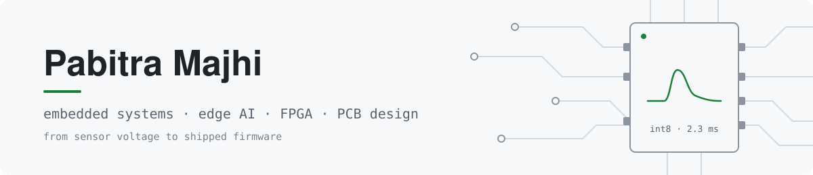
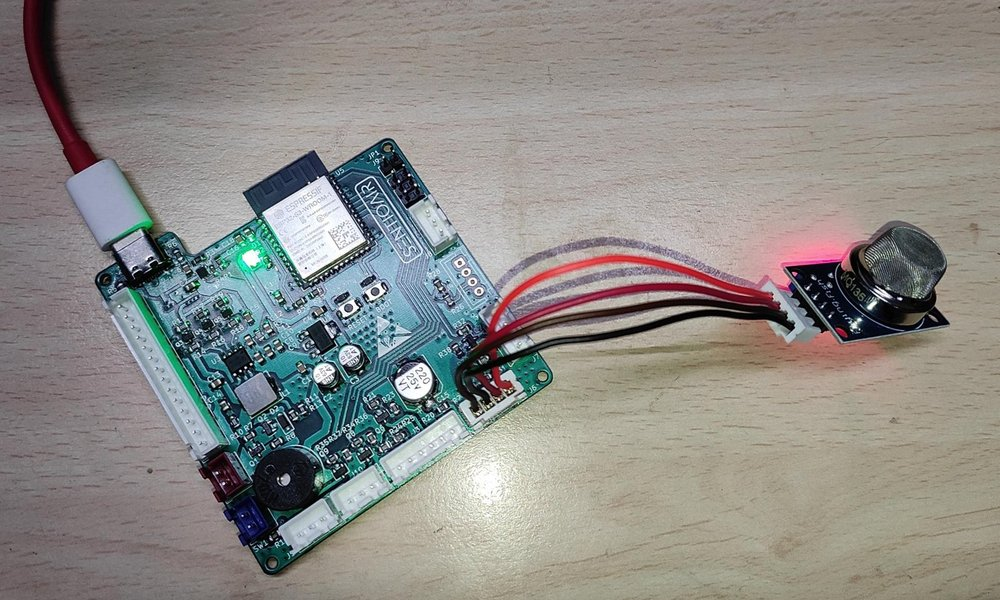
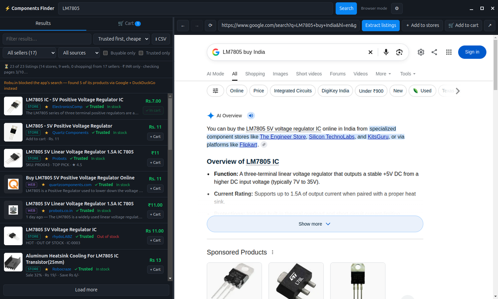

<picture>
  <source media="(prefers-color-scheme: dark)" srcset="assets/banner-dark.svg">
  
</picture>

I build hardware and the software that runs on it: firmware in C and C++ on the ESP32-S3, small neural networks
that fit in a few kilobytes of flash, digital logic in Verilog, and the boards underneath them. When a tool I
need doesn't exist, I write that too.

**Currently building:** SentioAir, an indoor air-quality monitor on the ESP32-S3 with a custom PCB.

## Projects

<table>
  <tr>
    <td width="50%" valign="top">
      
      <h3><a href="https://github.com/stimexpabs/esp32s3-smell-classifier">esp32s3-smell-classifier</a></h3>
      

        An eight-chapter tutorial that takes one MQ-135 gas sensor from raw voltage to a neural network running
        on the ESP32-S3. Firmware, recording tools, training pipeline, real recordings and the trained model are
        all in the repository.
      

      

        <b>516</b> parameters · <b>6,944</b> bytes of flash · <b>2.3 ms</b> per inference · board output matches
        the PC on <b>300 of 300</b> replayed windows
      

      
<code>C++</code> <code>ESP-IDF</code> <code>TensorFlow Lite Micro</code> <code>Python</code>

    </td>
    <td width="50%" valign="top">
      
      <h3><a href="https://github.com/stimexpabs/components-finder">components-finder</a></h3>
      

        A desktop app that finds where to buy an electronic component in India. One search covers 19 component
        stores, Google and Google Shopping, reads each listing's price in ₹ and its stock, and a cart re-checks
        both every hour.
      

      

        <b>19</b> stores built in · no account or API key · Linux AppImage ·
        <a href="https://github.com/stimexpabs/components-finder/releases/latest">latest release</a>
      

      
<code>JavaScript</code> <code>Electron</code> <code>GitHub Actions</code>

    </td>
  </tr>
</table>

**Also:** [learning-Verilog-with-projects](https://github.com/stimexpabs/learning-Verilog-with-projects), a UART
transmitter and receiver at 9600 baud for the Basys 3 FPGA board, built in Vivado.

## What I work with

<table>
  <tr><td><b>Firmware</b></td><td>C, C++, ESP-IDF, FreeRTOS, ESP32-S3</td></tr>
  <tr><td><b>Edge AI</b></td><td>TensorFlow, TensorFlow Lite Micro, int8 quantisation, Python</td></tr>
  <tr><td><b>Digital design</b></td><td>Verilog, Vivado, Basys 3</td></tr>
  <tr><td><b>Hardware</b></td><td>PCB design, sensor front ends, bring-up</td></tr>
  <tr><td><b>Desktop tools</b></td><td>JavaScript, Electron, C#</td></tr>
</table>

## How I work

- **Measure on the hardware.** Numbers in a README come from the board, with the conditions they were taken
  under.
- **Say what doesn't work.** If a result is optimistic or a sensor can't do something, the documentation says so.
- **Make it repeatable.** Data, tools and the trained model ship with the code, so the result can be reproduced
  from a clone.
- **Write it up.** A project isn't finished until someone else can follow it.

## Get in touch

Questions about a project are best asked as an issue on that repository. I read them.
